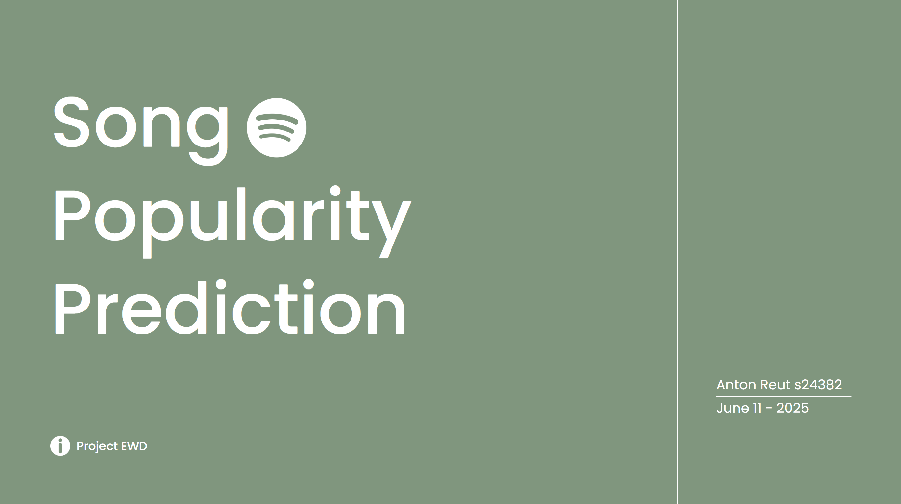
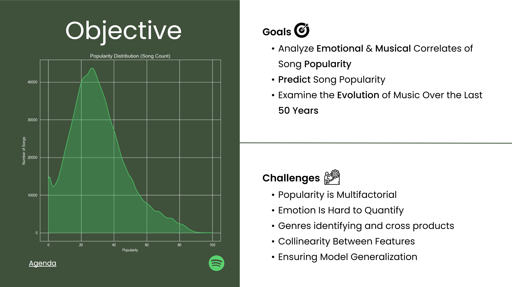
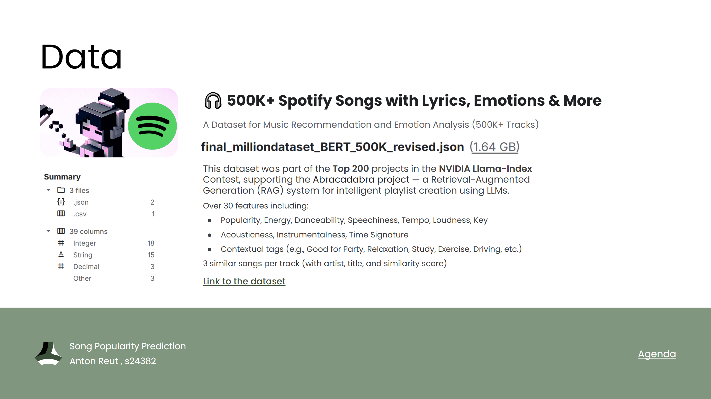
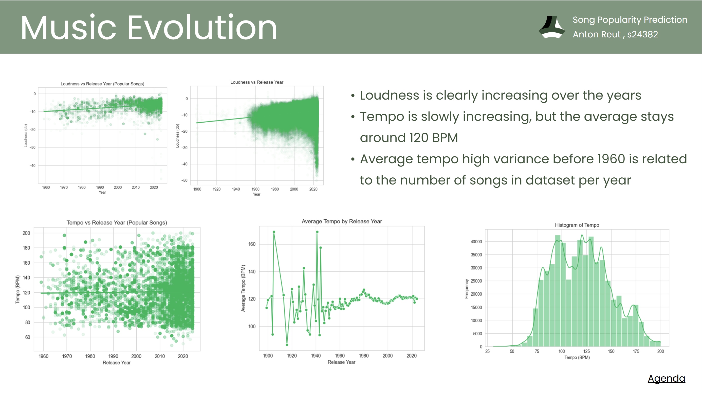
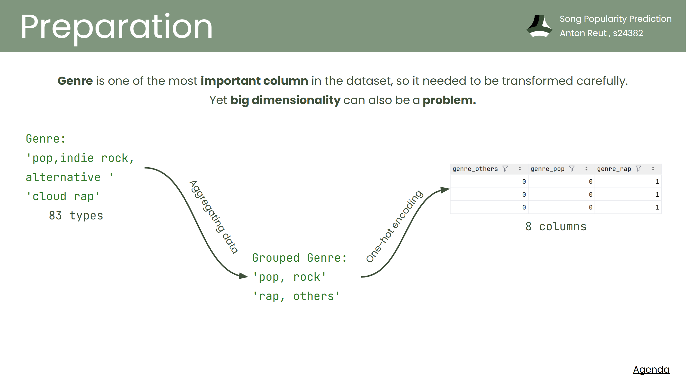
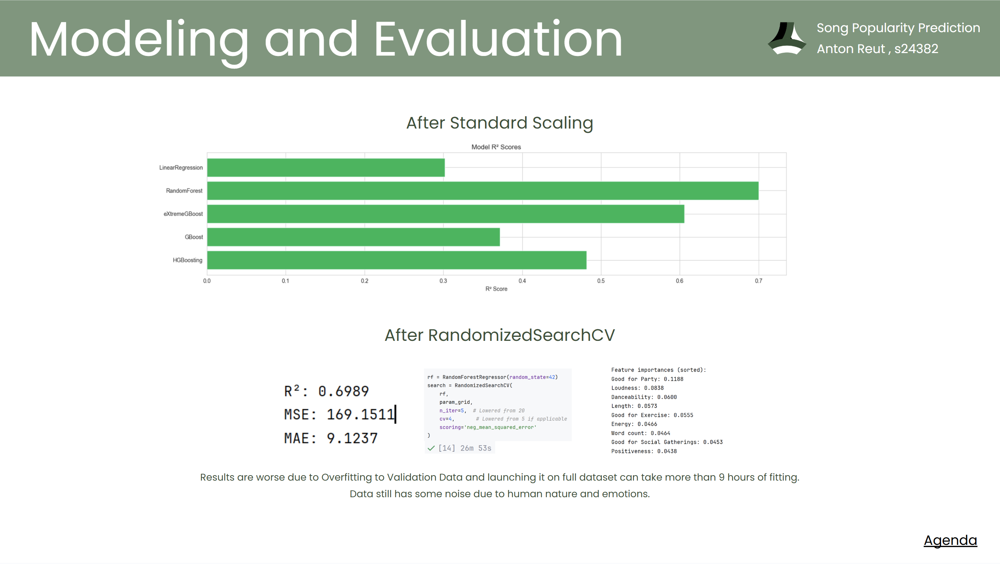

# Practises EWD (Estymacja i Wizualizacja Danych) 🎶📊

This repository contains a collection of data science practices and a major project focused on **estimating song popularity** using a dataset of 1 million tracks. All exercises and the main project were completed as part of the Estymacja i Wizualizacja Danych (Estimation and Data Visualization) course.

---

## 📁 Repository Structure

- **/cXX**  
  Folders for each practice (XX = practice number), each containing:
    - Data files
    - Jupyter notebooks with tasks (`labXX-task.ipynb`)
    - Jupyter notebooks with solutions (`labXX-solution.ipynb`)

- **/project**  
  The main project folder, containing all files related to the song popularity estimation project.

---

## 🎵 Main Project: Estimating Song Popularity

### Overview

The goal of this project is to predict the popularity of songs based on a rich set of features extracted and engineered from a large dataset. The workflow includes data exploration, feature engineering, modeling, and evaluation.

- **Project Presentation:**  
  [project-presentation.pdf](https://github.com/LaneyBlack/Practices-EWD/blob/master/project/project-presentation.pdf)

- **Best Model R² Score:**  
  `0.6989` 🏆

---

### ✨ Key Features

#### 🎯 Objective

#### 📊 Found Data

#### 🔍 Data Exploration & Music Evolution Stats

- Statistical summaries and visualizations of song features
- Analysis of music trends over time

#### 🛠️ Data Preparation

- **Column Dropping:**  
  Removed non-informative columns: `['Artist(s)', 'song', 'Album', 'Similar Songs', 'ISRC']`
- **Outlier Handling:**  
  Standardized categorical values (e.g., `'love'` and `'Love'`)
- **Feature Engineering:**
    - **Length:** Converted from string (e.g., `'1:23'`) to integer seconds (`83`)
    - **Loudness:** Converted from string (e.g., `'-6.5db'`) to float (`-6.5`)
    - **Date:** Extracted year, month, and calculated age from strings (e.g., `'29th April 2013'` → Year: `2013`, Month: `4`, Age: `12`)
- **Handling Missing Data:**  
  Dropped columns with excessive missing values
- **Encoding:**
    - One-hot encoding for categorical features
    - Genre aggregation and encoding
    - TF-IDF vectorization for text fields
- **Language Detection:**  
  Identified and encoded song language 🌍

#### 🤖 Modeling & Evaluation

- Built and tuned regression models to estimate song popularity
- Evaluated model performance using R² metric

#### 📈 Conclusions

- Summarized key findings and insights from the modeling process
- Discussed the impact of feature engineering and data preparation on model accuracy

---

## 🚀 Getting Started

1. **Clone the repository:**
2. **Navigate to the desired practice folder or the `project` directory.**
3. **Open Jupyter notebooks:**

4. **Explore the code, data, and results.**

---

## 🧰 Requirements

- Python 3.9+
- Jupyter Notebook
- Standard data science libraries:  
  `pandas`, `numpy`, `scikit-learn`, `matplotlib`, `seaborn`, etc.

---

## 📜 License

This project is for educational purposes.

---

## 📬 Contact

For questions or feedback, please open an issue or contact the repository owner via GitHub.

---

Enjoy exploring the world of data science and music analytics! 🎼✨

